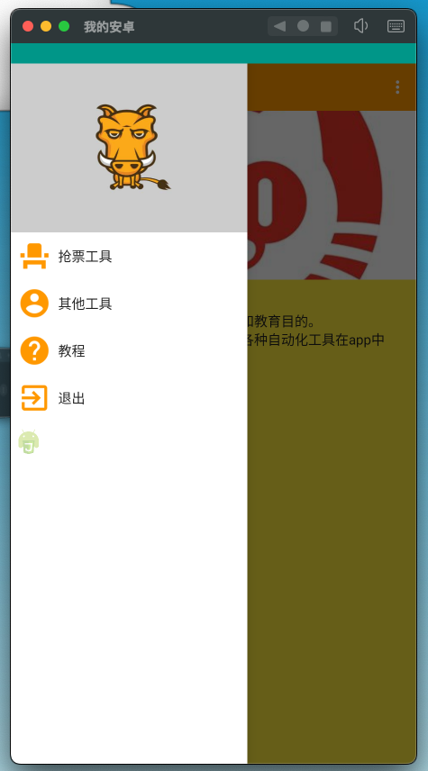
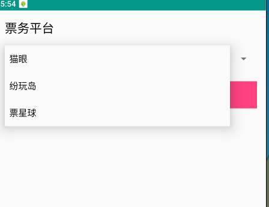

# Piaoboss

闲暇无事写的一个抢票软件，旨在帮助用户自动化抢购各种票务平台的票务。当前版本支持以下平台(觉得对你有帮助请star 一下😁)：

- **猫眼**：一个流行的电影票务平台。
- **票星球**：提供各种票务服务的综合平台。
- **纷玩岛**：另一种受欢迎的票务平台。

## 功能

- **自动化抢票**：自动监控票务销售时间，并在开售时自动抢票。
- **多平台支持**：支持猫眼、票星球和纷玩岛，未来将逐步增加更多平台。
- **用户友好界面**：简洁的用户界面，易于使用和操作。
- **实时状态监控**：提供实时的抢票状态反馈，帮助用户了解抢票进度。

## 图片展示

以下是 Piaoboss 的界面截图和功能展示：

### 主界面

### 抢票界面

## 计划功能

- **支持更多票务平台**：后期计划添加对更多票务平台的支持。
- **优化用户体验**：持续改进界面和功能，提供更好的用户体验。
- **增强稳定性**：解决潜在的错误和问题，提升应用稳定性。

## 联系方式

如果你有任何问题或建议，请通过以下方式联系我：

- **Email**: 1003941268@qq.com
- **GitHub Issues**: [打开 Issue](https://github.com/code-innovator-zyx/piaoboss/issues)

## 许可证

本项目使用 [MIT License](LICENSE) 进行许可。请参阅 LICENSE 文件了解详细信息。

## 使用声明
本项目仅供个人学习、研究以及代码示例参考之用。使用者应遵守所在地相关法律法规，严禁将本项目用于任何违反法律或侵害他人合法权益的行为。

开发者不对使用者因本项目带来的任何直接或间接后果承担责任，包括但不限于因不当使用、滥用或非法使用本项目所导致的法律责任。

请在下载、使用本项目之前仔细阅读本声明，使用即表示您已阅读并同意本声明的所有条款。

V我一下催更(点赞吹更)：
